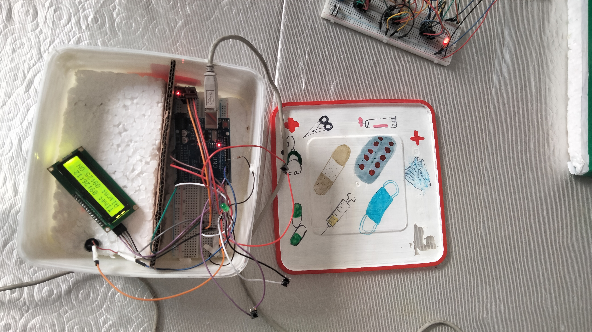
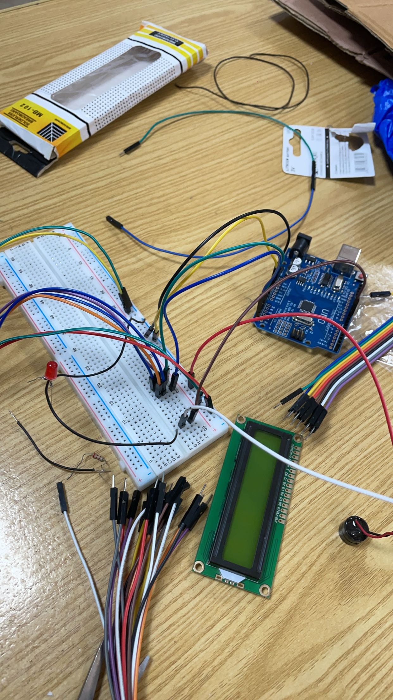
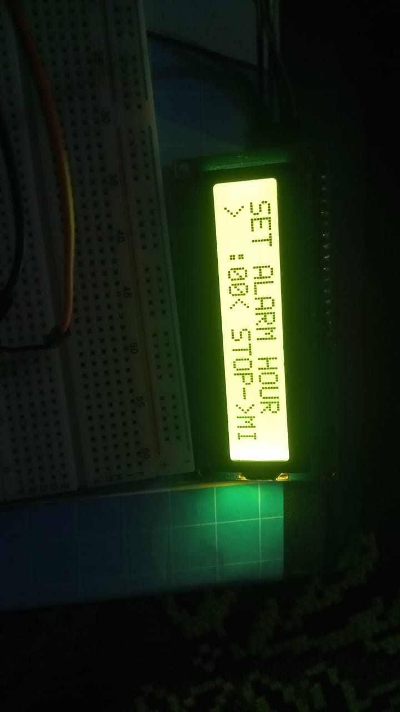

# 💊 Smart Medicine Reminder System


---

## Table of Contents
1. [Overview](#overview)
2. [Problem Statement](#problem-statement)
3. [Features](#features)
4. [Components Used](#components-used)
5. [Circuit Diagram](#circuit-diagram)
6. [Pin Connections](#pin-connections)
7. [How It Works](#how-it-works)
8. [Arduino Code and Setup](#arduino-code-and-setup)
9. [User Guide](#user-guide)
10. [Team Members](#team-members)
11. [Technologies and Tools](#technologies--tools)
12. [Project Photos](#project-photos)
13. [Future Improvements](#future-improvements)
14. [License](#license)
15. [Contact](#contact)
16. [Support](#support)

---

## Overview

The **Smart Medicine Reminder System** is an embedded systems project designed to help users remember their medication schedules. Using an Arduino UNO, a real-time clock (RTC) module, and an LCD display, the system provides visual and audio alerts at preset medicine times. This low-cost, user-friendly solution addresses a critical healthcare challenge – medication non-adherence – especially among elderly patients.

> *Built as part of our academic journey to explore embedded systems, real-time applications, and practical healthcare solutions.*

---

## Problem Statement

Millions of people worldwide forget to take their medication on time, leading to:
- ⚠️ Worsening of chronic conditions
- 🏥 Increased hospitalizations
- 💰 Higher healthcare costs
- 📉 Reduced quality of life

Our goal was to create a **simple, affordable, and effective** reminder system that can be used by anyone, anywhere.

---

## Features

| **Feature** | **Description** |
|-------------|-----------------|
| ⏰ **Real-Time Clock** | Displays accurate time using DS3231 RTC Module |
| 🔔 **Audio Alert** | Piezo buzzer triggers when it's time to take medicine |
| 💡 **Visual Alert** | LED blinks simultaneously with buzzer |
| 🖥️ **LCD Display** | Shows current time, set reminder time, and status messages |
| 🔘 **Adjustable Timer** | Hour and Minute push buttons to set reminder time |
| 🛑 **Stop Button** | Dismisses the alarm after acknowledgment |
| 🔋 **Low Cost** | Built with affordable, easily available components |
| ⚡ **User-Friendly** | Simple interface – anyone can use it without technical knowledge |

---

## Components Used

| **Component** | **Quantity** | **Purpose** |
|---------------|--------------|-------------|
| Arduino UNO | 1 | Main microcontroller |
| DS3231 RTC Module | 1 | Real-time clock for accurate timekeeping |
| 16×2 LCD Display (I2C) | 1 | Display time, status, and alerts |
| Piezo Buzzer | 1 | Audio alert/alarm |
| LED (Red) | 1 | Visual alert/alarm |
| Push Buttons | 3 | Hour adjustment, Minute adjustment, Stop alarm |
| Resistors (220Ω) | 2 | Current limiting for LED and buzzer |
| Breadboard | 1 | Circuit assembly |
| Jumper Wires | Multiple | Connections between components |
| USB Cable | 1 | Power and programming |

---

## Circuit Diagram
```text

+---------------------------+
| Arduino UNO |
| |
| 5V ---------------------+-----> RTC VCC, LCD VCC, Buzzer VCC
| GND ---------------------+-----> RTC GND, LCD GND, Buzzer GND
| |
| A4 (SDA) --------------> RTC SDA / LCD SDA
| A5 (SCL) --------------> RTC SCL / LCD SCL
| |
| D2 ---------------------> Push Button 1 (Hour +)
| D3 ---------------------> Push Button 2 (Minute +)
| D4 ---------------------> Push Button 3 (Stop Alarm)
| D5 ---------------------> LED (Anode via 220Ω)
| D6 ---------------------> Buzzer (via 220Ω)
| |
+---------------------------+


LCD 16x2 (I2C)
+-----------------+
| VCC ---- 5V |
| GND ---- GND |
| SDA ---- A4 |
| SCL ---- A5 |
+-----------------+


DS3231 RTC
+-----------------+
| VCC ---- 5V |
| GND ---- GND |
| SDA ---- A4 |
| SCL ---- A5 |
+-----------------+


[Buzzer] ---- D6 ---- GND
[LED] ---- D5 ---- GND
[Button1] ---- D2 ---- GND
[Button2] ---- D3 ---- GND
[Button3] ---- D4 ---- GND


```


---

## Pin Connections

| **Arduino Pin** | **Connected To** | **Notes** |
|-----------------|------------------|-----------|
| 5V | RTC VCC, LCD VCC, Buzzer VCC | Power supply |
| GND | RTC GND, LCD GND, Buzzer GND, LED Cathode, Buttons | Common ground |
| A4 (SDA) | RTC SDA, LCD SDA | I2C data line |
| A5 (SCL) | RTC SCL, LCD SCL | I2C clock line |
| D2 | Push Button 1 | Increment hours |
| D3 | Push Button 2 | Increment minutes |
| D4 | Push Button 3 | Stop alarm |
| D5 | LED (via 220Ω) | Visual alert |
| D6 | Buzzer (via 220Ω) | Audio alert |

---

## How It Works

1. **System Initialization**
   - The Arduino boots up and initializes the RTC module and LCD.
   - The LCD displays the current time and a default reminder time.

2. **Setting the Reminder Time**
   - The user presses **Hour Button** (D2) to increase the hour.
   - The user presses **Minute Button** (D3) to increase the minute.
   - The set time is stored and displayed on the LCD.

3. **Real-Time Monitoring**
   - The system continuously compares the current time (from RTC) with the set reminder time.

4. **Triggering the Alarm**
   - When the current time matches the set reminder time, the system triggers both audio and visual alerts.

5. **Dismissing the Alarm**
   - The user presses the **Stop Button** (D4) to silence the buzzer and turn off the LED.

---

## Arduino Code and Setup

The project is programmed in **C++** using the Arduino IDE. Below are complete instructions to get your system up and running.

---

### 1. Install Required Libraries

Before uploading the code, you need to install two libraries in the Arduino IDE.

**Step-by-step:**
1. Open **Arduino IDE** on your computer.
2. Go to **Sketch** → **Include Library** → **Manage Libraries...**
3. In the search bar, type **`RTClib`**.
4. Find **"RTClib by Adafruit"** and click **Install**.
5. In the search bar, type **`LiquidCrystal I2C`**.
6. Find **"LiquidCrystal_I2C by Frank de Brabander"** and click **Install**.
7. Close the Library Manager window.

---

### 2. Connect Your Hardware

Connect the components to your Arduino UNO as per the pin connections table above.

**Quick Reference:**

| **Arduino Pin** | **Connected To** |
|-----------------|------------------|
| 5V | RTC VCC, LCD VCC |
| GND | RTC GND, LCD GND, Buzzer GND, LED Cathode, Button pins |
| A4 (SDA) | RTC SDA, LCD SDA |
| A5 (SCL) | RTC SCL, LCD SCL |
| D2 | Hour Button (other pin to GND) |
| D3 | Minute Button (other pin to GND) |
| D4 | Stop Button (other pin to GND) |
| D5 | LED Anode (via 220Ω resistor) |
| D6 | Buzzer Positive (via 220Ω resistor) |

> ⚠️ **Important:** Buttons use internal pull-up resistors, so one leg goes to the Arduino pin and the other leg goes to **GND**. When pressed, the pin reads LOW.

---

### 3. Download the Code

- The full Arduino code (`medicine_reminder.ino`) is available in the `code/` folder of this repository.
- Or copy the code directly from the [`code/medicine_reminder.ino`](code/medicine_reminder.ino) file.

---

### 4. Upload the Code to Arduino

**Step-by-step:**
1. Connect your Arduino UNO to your computer using a **USB cable**.
2. Open **Arduino IDE**.
3. Click **File** → **Open** and select the `medicine_reminder.ino` file.
4. Go to **Tools** → **Board** → select **"Arduino Uno"**.
5. Go to **Tools** → **Port** → select the COM port your Arduino is connected to (e.g., `COM3` on Windows or `/dev/ttyUSB0` on Linux/Mac).
6. Click the **Upload** button (➡️ right arrow icon) in the top left corner.
7. Wait for the upload to complete. You should see **"Done uploading"** in the bottom status bar.

---

### 5. Set the RTC Time (First Time Only)

The first time you run the system, you need to set the correct time on the RTC module.

**Option A: Automatic (Compile Time)**
- The code is already configured to set the RTC to the time when the sketch was compiled.
- Just uncomment this line in `setup()`:
  ```cpp
  // rtc.adjust(DateTime(F(__DATE__), F(__TIME__)));
Remove the `//` to enable it, upload once, then comment it again to prevent resetting on every upload.

---

### ⏰ Option B: Manual

Replace the line with your current date and time:

```cpp
rtc.adjust(DateTime(2026, 6, 27, 14, 30, 0));
// Year, Month, Day, Hour, Minute, Second (24-hour format)
```

Upload once, then comment it out.

---

## 🎯 Test the System

- The LCD should display **"Smart Medicine Reminder System"** for **2 seconds**, then show the current time and alarm time.
- Press the **Hour Button (D2)** to increase the alarm hour.
- Press the **Minute Button (D3)** to increase the alarm minute.
- Set the alarm to **1–2 minutes ahead** of the current time.
- Wait – when the time matches, the **buzzer will sound** and the **LED will blink**.
- Press the **Stop Button (D4)** to dismiss the alarm.

---

## ❓ Troubleshooting

| **Issue** | **Solution** |
|-----------|--------------|
| LCD shows **"RTC ERROR!"** | Check wiring: **SDA → A4, SCL → A5, 5V → VCC, GND → GND** |
| LCD shows nothing/boxes | Change `LCD_ADDRESS` from `0x27` to `0x3F` in the code |
| Time resets when power is off | The RTC battery (**CR2032**) is dead – replace it |
| Buttons not responding | Buttons must connect between the pin and **GND** (using `INPUT_PULLUP`) |
| Alarm triggers at wrong time | RTC time is incorrect – re-run the `rtc.adjust()` code |
| **"Library not found"** error | Install both required libraries via Library Manager |
| Upload fails | Check Port selection and USB cable connection |

---

## 📁 Code File Location

The full code is saved as:

```text
code/medicine_reminder.ino
```

You can view it directly in this repository or download it to upload to your Arduino.

---

# User Guide

| **Step** | **Action** | **Result** |
|----------|------------|------------|
| 1 | Power on the system | LCD shows current time and default reminder |
| 2 | Press **Hour Button** | Hour value increments (0–23) |
| 3 | Press **Minute Button** | Minute value increments (0–59) |
| 4 | Wait for set time | System monitors time in background |
| 5 | Alarm triggers at set time | Buzzer sounds, LED blinks, LCD alerts |
| 6 | Press **Stop Button** | Alarm stops, system resets to monitoring mode |

---

# Team Members

| **Name** | **Role** | **Contributions** |
|----------|----------|-------------------|
| **Muhammad Umar Afzal** | Project Lead / Programmer | LCD integration, buzzer logic, code debugging, system testing, README documentation |
| **[Friend 1 Full Name]** | Hardware Engineer | Circuit assembly, hardware connections, component selection, soldering |
| **[Friend 2 Full Name]** | Embedded Developer | RTC module programming, push button logic, I2C communication, documentation |

> *All team members collaborated on testing, troubleshooting, and finalizing the project.*

---

# Technologies & Tools

| **Category** | **Technologies** |
|--------------|------------------|
| **Microcontroller** | Arduino UNO (ATmega328P) |
| **Programming Language** | C++ (Arduino IDE) |
| **Communication Protocol** | I2C (for RTC and LCD) |
| **RTC Module** | DS3231 (High-precision real-time clock) |
| **Display** | 16×2 LCD with I2C backpack |
| **Version Control** | Git & GitHub |
| **Documentation** | Markdown (`README.md`) |

---

## Project Photos

### 🖼️ Final Working Setup


### 🔬 Circuit Close-up


### 📺 LCD Display


### 🔧 System Components

---

# Future Improvements

- [ ] **Add a buzzer snooze function** – Allow user to snooze the alarm for 5 minutes.
- [ ] **Multiple medication times** – Support up to 3 different reminder times.
- [ ] **Wireless connectivity** – Integrate ESP8266 for IoT notifications via mobile app.
- [ ] **OLED display upgrade** – Replace LCD with OLED for better visibility.
- [ ] **Battery backup** – Add battery so the RTC retains time even when unplugged.
- [ ] **Voice alerts** – Add a speaker module for voice-based reminders.
- [ ] **Mobile app integration** – Send push notifications to mobile phones.
- [ ] **Data logging** – Log missed/acknowledged reminders to SD card.

---


# License

This project is licensed under the **MIT License** – you are free to use, modify, and distribute it for personal or commercial purposes. See the **LICENSE** file for details.

```text
MIT License

Copyright (c) 2026 Muhammad Umar Afzal, [Friend 1 Full Name], [Friend 2 Full Name]

Permission is hereby granted, free of charge, to any person obtaining a copy
of this software and associated documentation files (the "Software"), to deal
in the Software without restriction, including without limitation the rights
to use, copy, modify, merge, publish, distribute, sublicense, and/or sell
copies of the Software, and to permit persons to whom the Software is
furnished to do so, subject to the following conditions:

The above copyright notice and this permission notice shall be included in all
copies or substantial portions of the Software.

THE SOFTWARE IS PROVIDED "AS IS", WITHOUT WARRANTY OF ANY KIND, EXPRESS OR
IMPLIED, INCLUDING BUT NOT LIMITED TO THE WARRANTIES OF MERCHANTABILITY,
FITNESS FOR A PARTICULAR PURPOSE AND NONINFRINGEMENT. IN NO EVENT SHALL THE
AUTHORS OR COPYRIGHT HOLDERS BE LIABLE FOR ANY CLAIM, DAMAGES OR OTHER
LIABILITY, WHETHER IN AN ACTION OF CONTRACT, TORT OR OTHERWISE, ARISING FROM,
OUT OF OR IN CONNECTION WITH THE SOFTWARE OR THE USE OR OTHER DEALINGS IN THE
SOFTWARE.
```

---

# Contact

For questions, suggestions, or collaboration, feel free to reach out:

| **Name** | **LinkedIn** | **GitHub** | **Email** |
|----------|--------------|------------|-----------|
| Muhammad Umar Afzal | [LinkedIn URL] | [GitHub URL] | [Email] |
| [Friend 1 Name] | [LinkedIn URL] | [GitHub URL] | [Email] |
| [Friend 2 Name] | [LinkedIn URL] | [GitHub URL] | [Email] |

---

# Support

If you found this project helpful:

- ⭐ Star this repository on GitHub
- 🔄 Share it with your network
- 💬 Leave a comment or feedback

---

# 🤝 Built with Teamwork & Passion ❤️
````
